## PHP-1-PHPStorm作业

#### 1.基于扩展库的自动完成

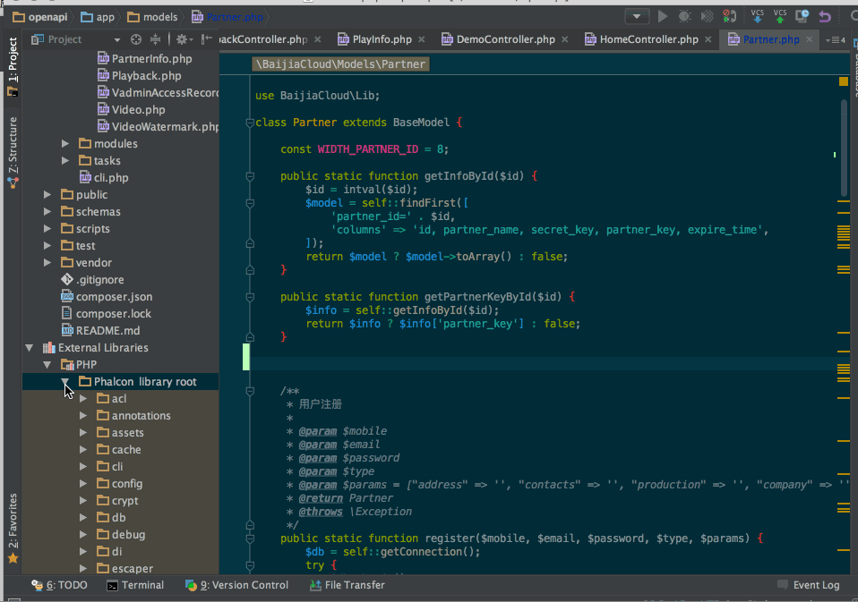

#### 2.基于metadata的自动完成

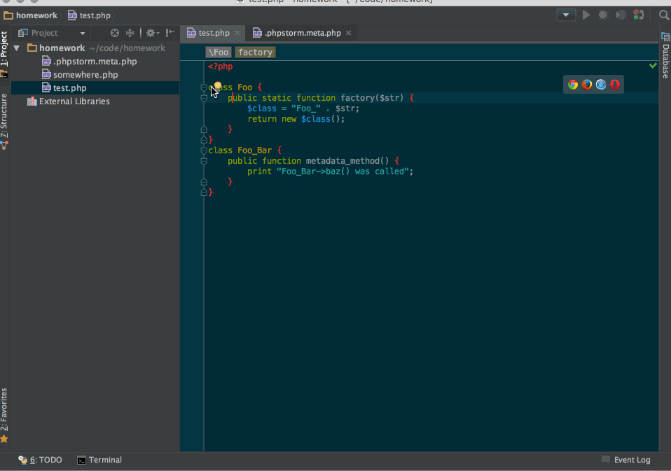

#### 3.使用PHPDOC辅助自动完成

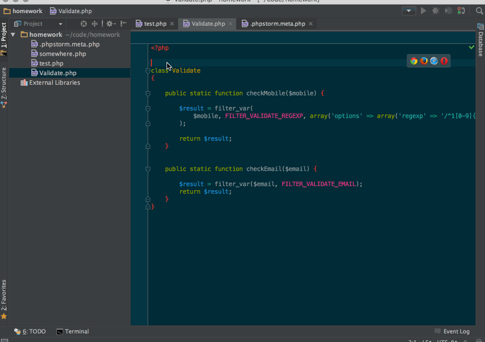

#### 4.代码格式化

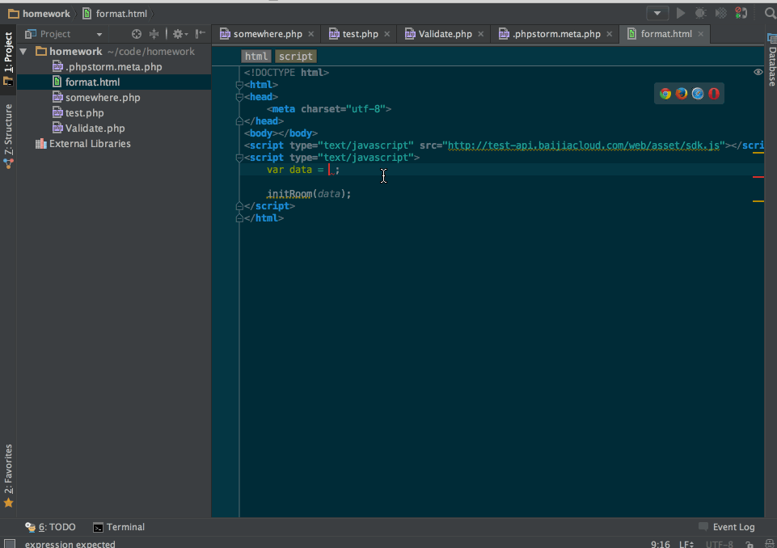

#### 5.重构相关

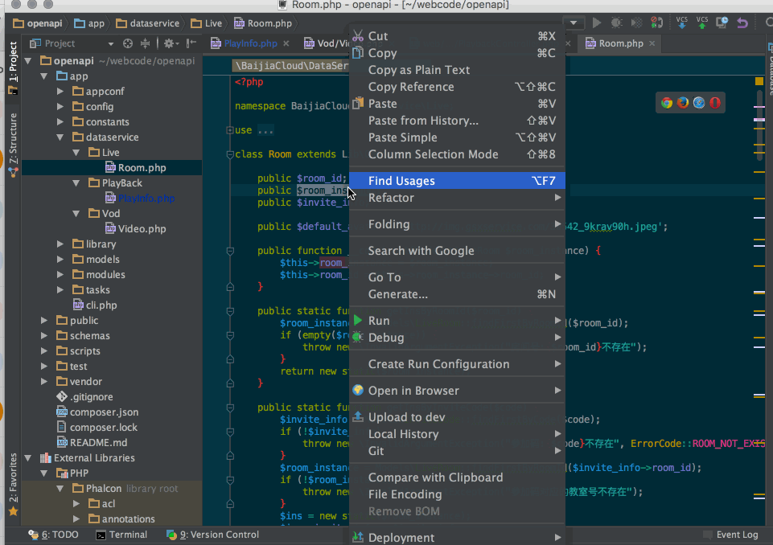

#### 6.创建类时自动填充命名空间

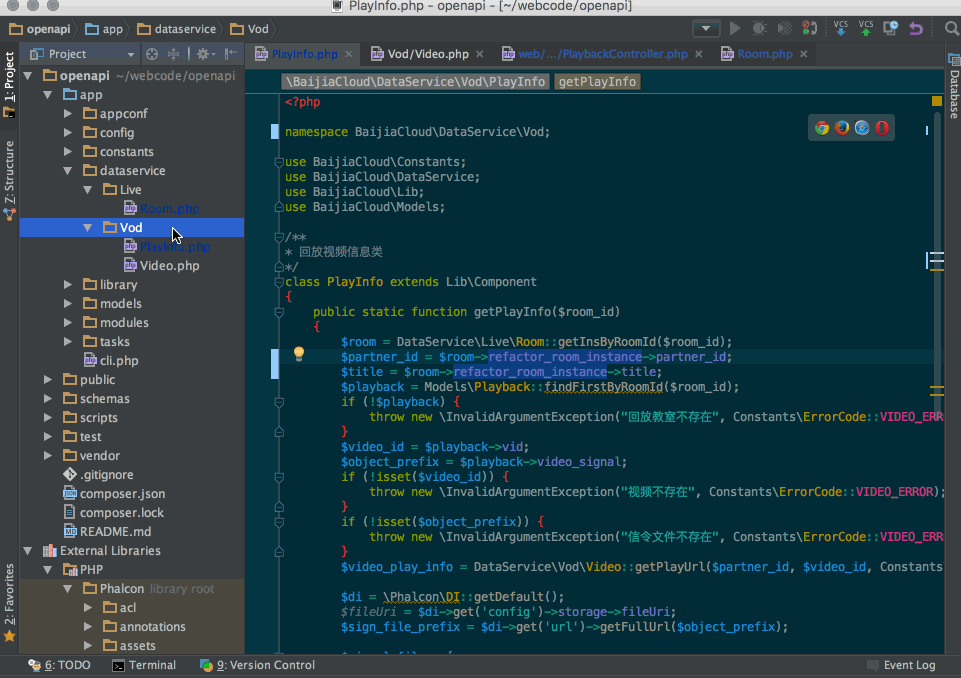

#### 7.代码重复检测

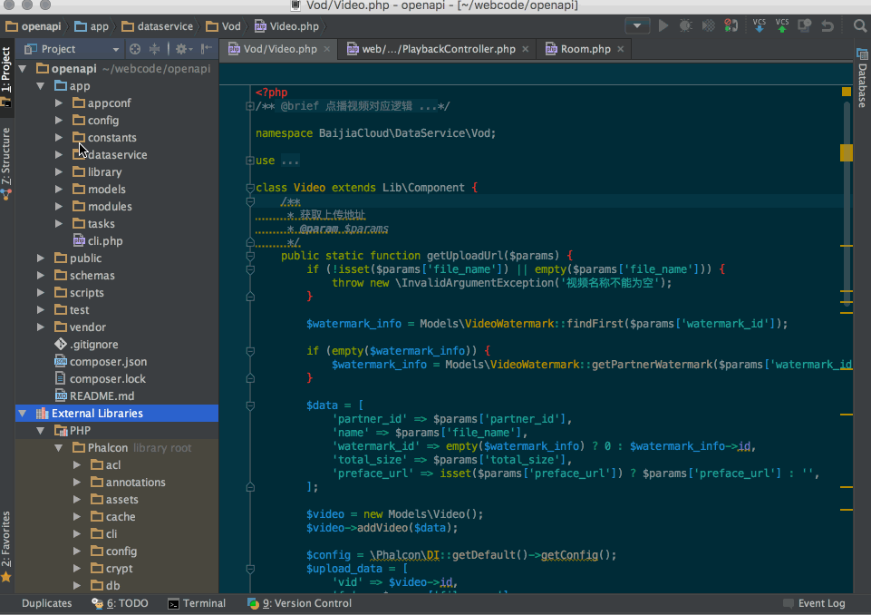

#### 8.统计类属性流向

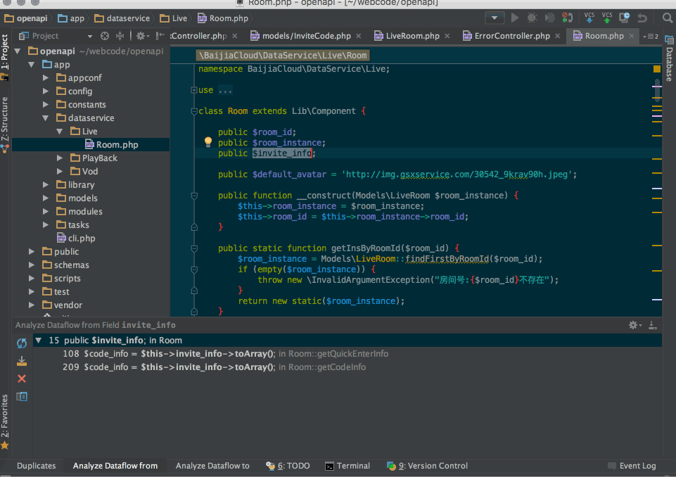

#### 9.使用代码审查功能

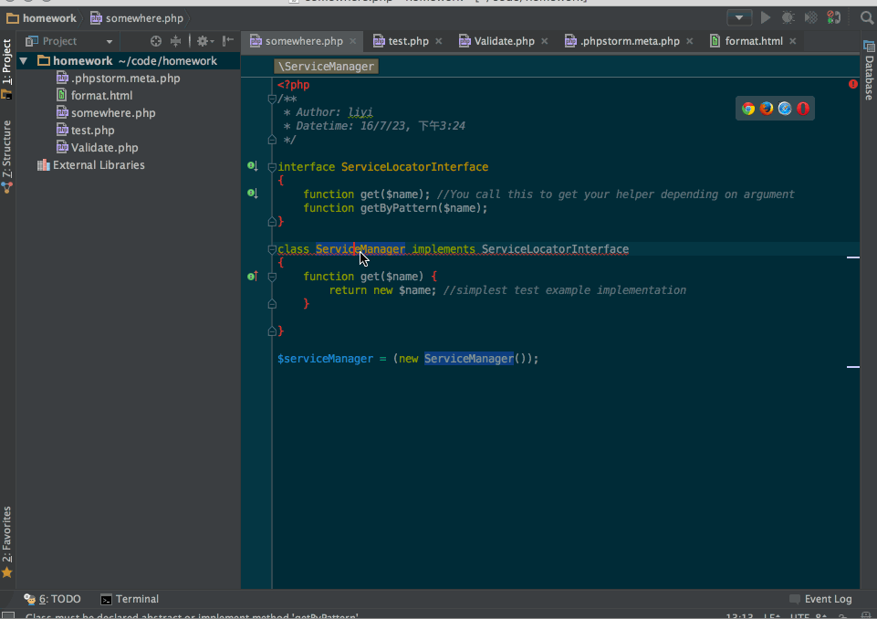

#### 10.导航到声明和调用

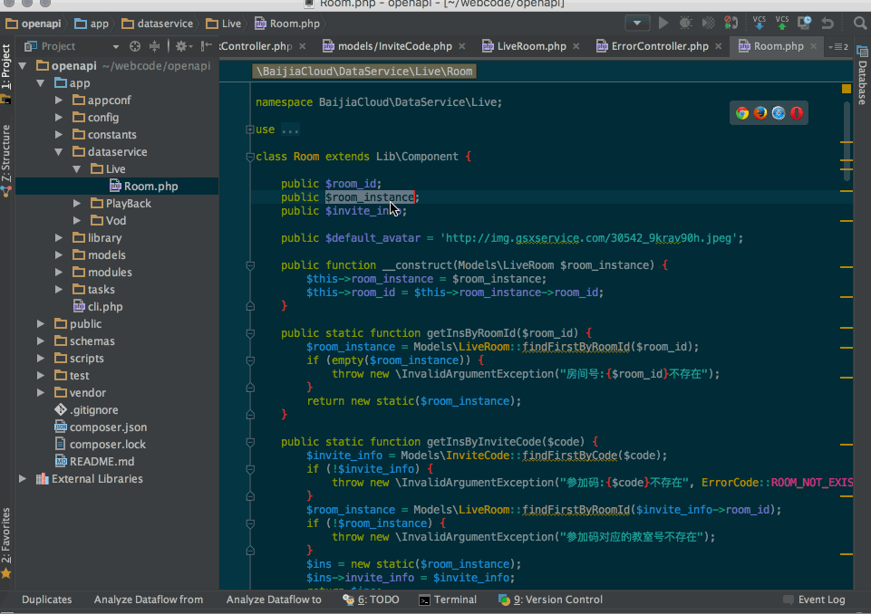

#### 11.排除一个项目目录

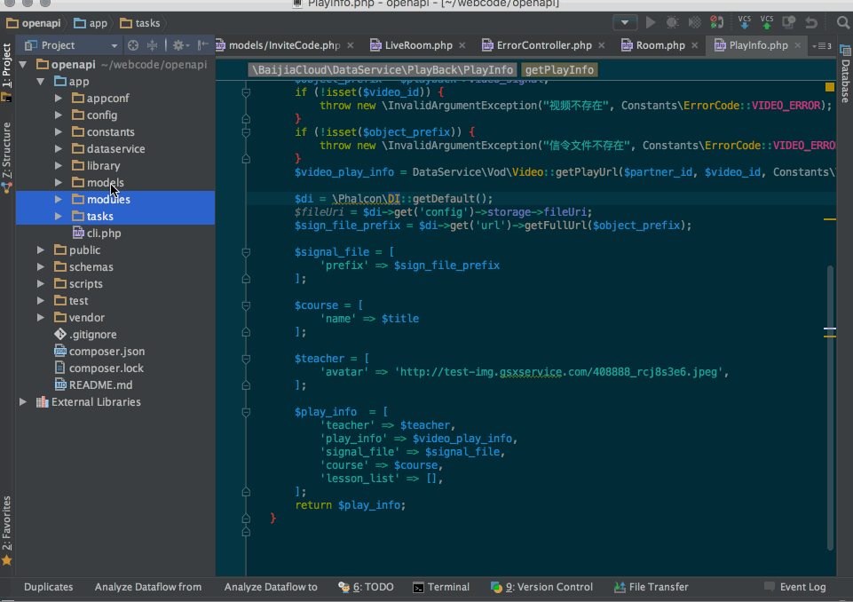

#### 12.断点调试功能

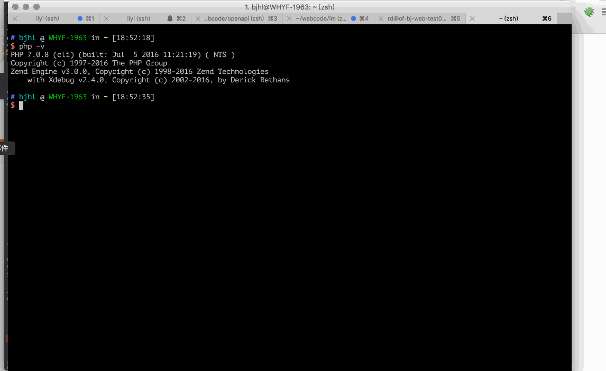

#### 13.GIT log功能

#### 14.查看数据库功能

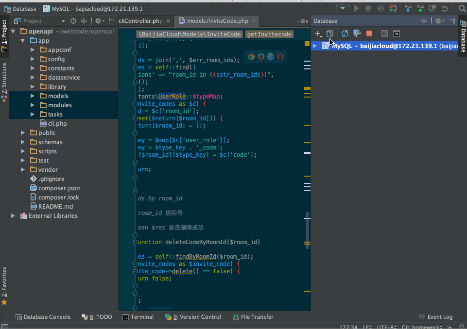

#### 15.自动部署功能

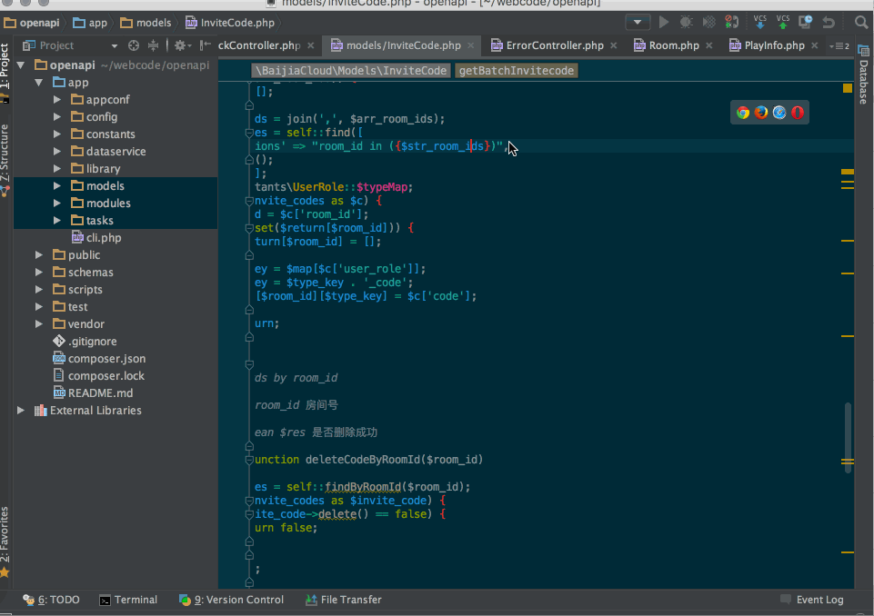

这个功能好用啊！